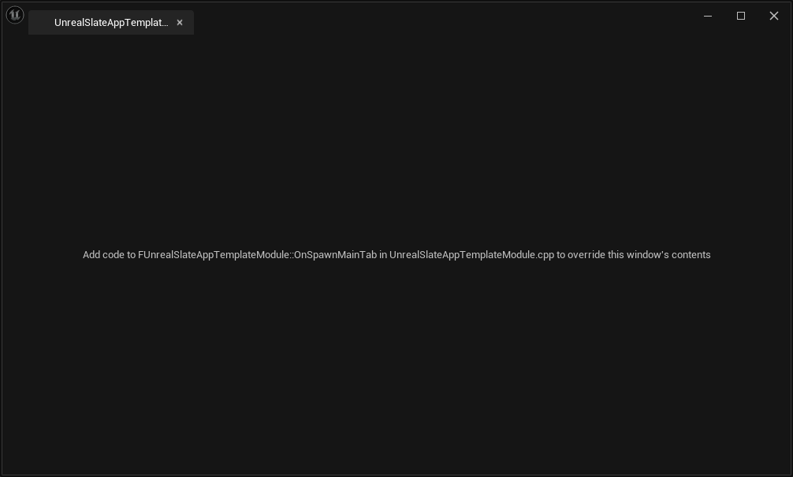
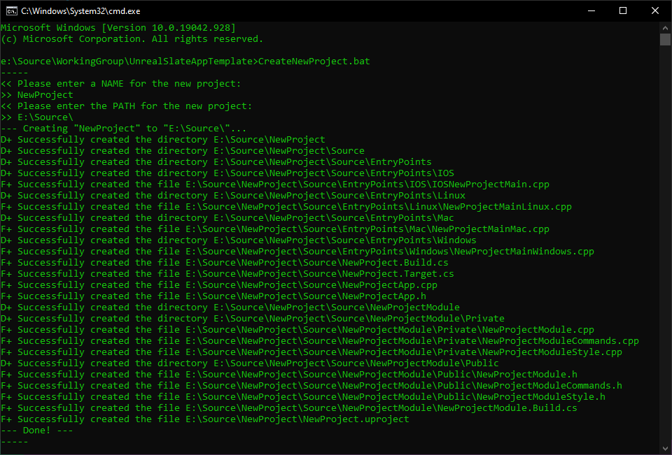
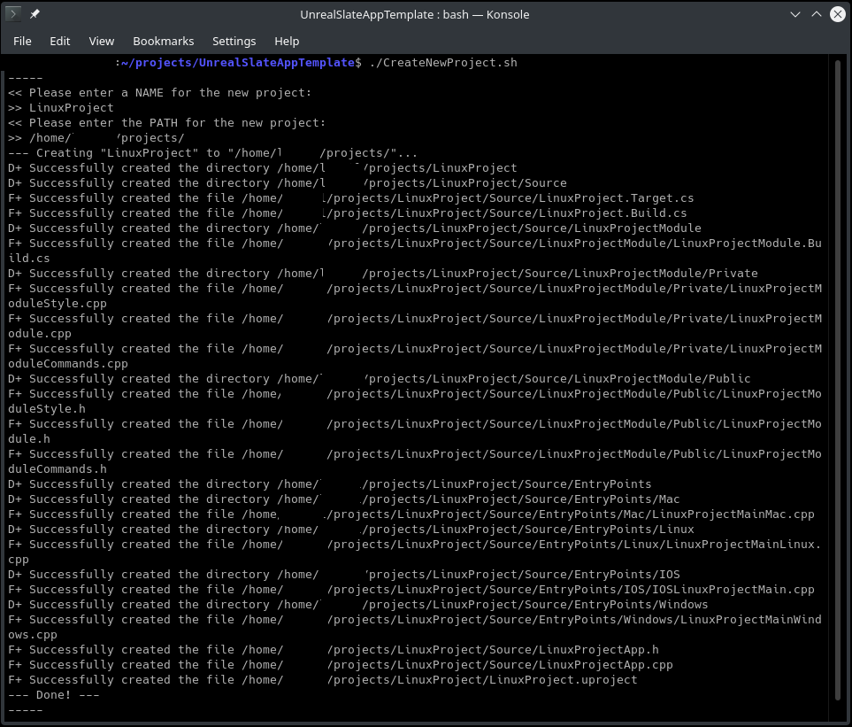
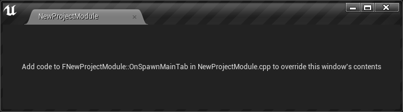
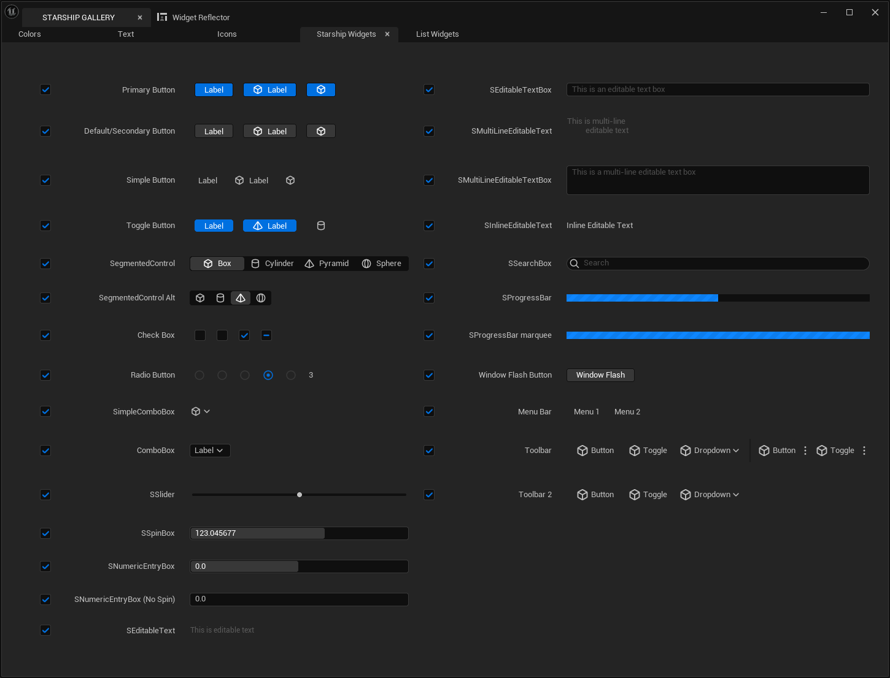
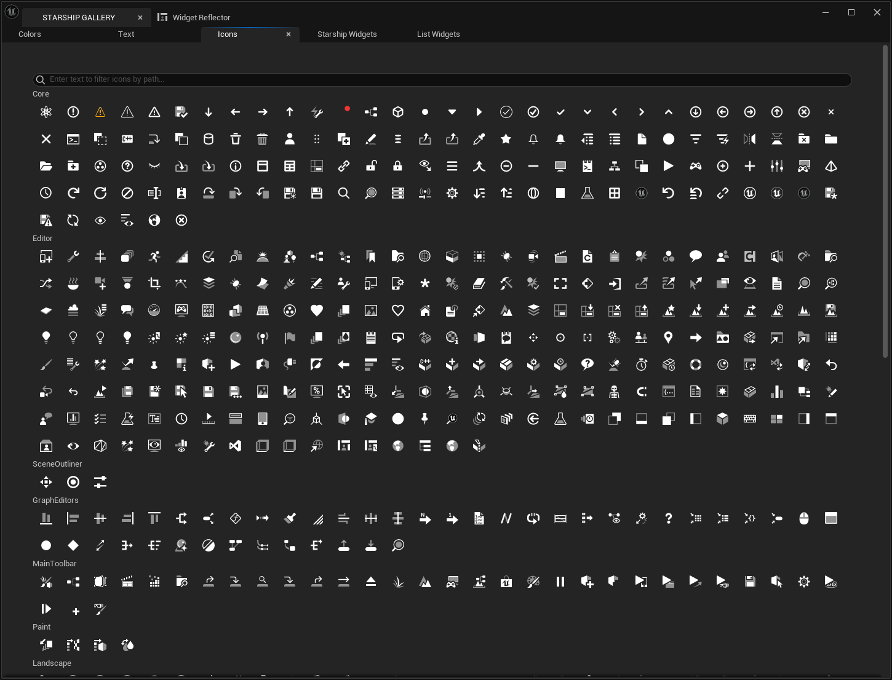
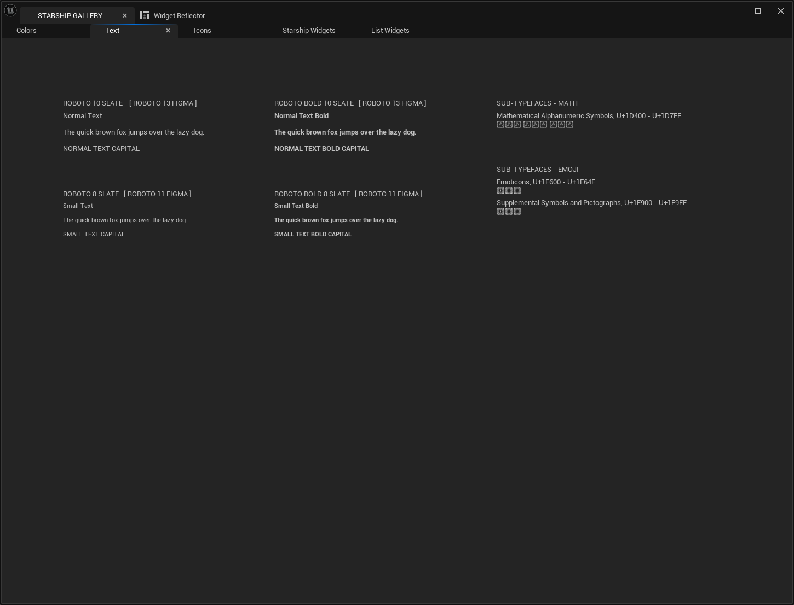
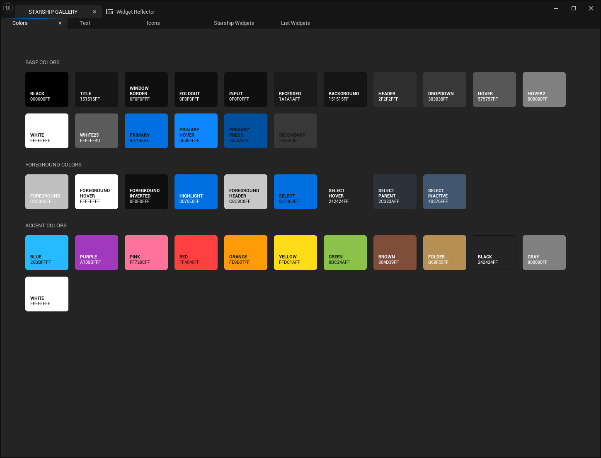

# UnrealSlateAppTemplate #

Project template for creating cross-platform desktop applications based on [Unrial Engine](https://www.unrealengine.com/). For the GUI, the [Slate UI Framework](https://docs.unrealengine.com/en-US/ProgrammingAndScripting/Slate/index.html) (part of UnrealEngine) is used.

## Description ## 

This repository is a basic standalone application template based on the [Slate UI Framework](https://docs.unrealengine.com/en-US/ProgrammingAndScripting/Slate/index.html). This is how [Gerke Max Preussner says about the framework](https://gmpreussner.com/portfolio/slate-ui):

> Slate is written entirely in C++ and runs on all Unreal Engine 4 supported platforms. It is render interface agnostic, which allows it to be used in standalone desktop and mobile applications that do not depend on the game engine. Its architecture rests on two powerful concepts that distinguish it from many classical frameworks: declarative syntax and composition.

This repository contains the basic foundation for your future cross-platform application. 

As far as I know, there is currently no easy way to generate such an almost empty project. The GitHub repository with the UE4 contains only a few examples of stand-alone applications, on the basis of which I made this repository for quick and convenient generation of your own application.

## Requirements ##

1) In order for the "TemplateRenamer" Tool in the form of a script to run correctly, you need to install [Python 3](https://www.python.org/downloads/) (tested with 3.8, 3.9, 3.12):
    * Windows - https://www.python.org/downloads/windows/
    * Linux - https://www.python.org/downloads/source/
    * MacOS - https://www.python.org/downloads/mac-osx/
2) In order for the project to be generated, compiled and run after renaming, you need to have an up-to-date version of [Unrial Engine](https://www.unrealengine.com/) (tested on 5.2, 5.3) compiled from [sources from GitHub](https://github.com/EpicGames/UnrealEngine) (**Release** branch is recommended). For this, there is a detailed instruction from EpicGames: 
    * [How do I access Unreal Engine C++ source code via GitHub?](https://www.unrealengine.com/en-US/ue-on-github)
    * [Downloading Unreal Engine Source Code](https://docs.unrealengine.com/en-US/ProgrammingAndScripting/ProgrammingWithCPP/DownloadingSourceCode/index.html)
    * [Building Unreal Engine from Source](https://docs.unrealengine.com/en-US/ProductionPipelines/DevelopmentSetup/BuildingUnrealEngine/index.html)

## Quick start ##

In order to get a new project with a new name, you need to do the following:

1) [Install and configure all requirements](#_requirements)
2) Go to the root of the repository and run the script `CreatNewProject` (`CreatNewProject.bat` for Windows and `CreatNewProject.sh` for Linux and MacOS). This step will execute the `Tools/TemplateNamer/TemplateRenamer.py` script interactively.
3) In the command line window, you will first need to enter the new project name, and then specify the path where to place the new project. The console will look something like this:

| Windows Cmd | Linux bash |
|:------------|:-----------|
|  |  |

4) Go to the folder with the newly created project, right-click on the `*.uproject` file and select "*Switch Unreal Engine version*" or "*Generate project files*" (there are alternative ways for the command line, [more details here](https://docs.unrealengine.com/en-US/ProductionPipelines/BuildTools/UnrealBuildTool/ProjectFilesForIDEs/index.html))
5) Now open your IDE for which the project was generated, select the project to start, and after compilation, you will see an empty window. 

Note: It is important to understand that at the first compilation, building the project can take a long time, since IDE tries to index the entire source code of the engine, as well as build the modules that are included in the dependencies. In the future, if you do not change the engine code, then the dependent modules will not be rebuilt, which means that the assembly of your project will be faster.

## Slate UI Gallery ##

All screenshots are taken from base app **SlateViewer**

* 
* 
* 
* 
